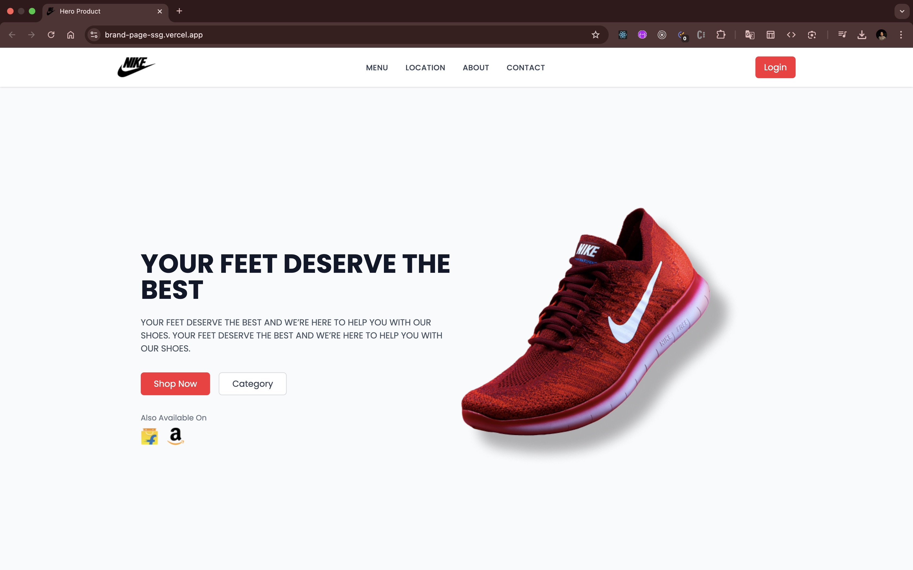

# Brand Page - React App

A modern and responsive brand landing page built with React and Tailwind CSS. This project is designed for practice and showcases a clean, user-friendly interface.


[Demo Link](https://brand-page-ssg.vercel.app/)




## Features

- **Responsive Design**: Optimized for mobile, tablet, and desktop screens.
- **Hero Section**: Eye-catching hero section with a call-to-action.
- **Navigation Bar**: Sticky navbar with smooth scrolling.
- **Interactive Buttons**: Hover and focus states for better user interaction.
- **Brand Integration**: Display of partner brands (e.g., Flipkart, Amazon).

## Technologies Used

- **React**: JavaScript library for building the user interface.
- **Tailwind CSS**: Utility-first CSS framework for styling.
- **Vite**: Fast build tool for modern web development.
- **React Icons**: For scalable vector icons (optional).

## Getting Started

Follow these steps to set up the project locally:

### Prerequisites

- Node.js (v16 or higher)
- npm (v8 or higher)

### Installation

1. Clone the repository:
   ```bash
   git clone https://github.com/surajgharpankar28/brand-page.git
   ```

2. Navigate to the project directory:
   ```bash
   cd brand-page
   ```

3. Install dependencies:
   ```bash
   npm install
   ```

4. Start the development server:
   ```bash
   npm run dev
   ```

5. Open your browser and visit:
   ```
   http://localhost:5173
   ```

### Building for Production

To create an optimized production build:
```bash
npm run build
```

## Folder Structure

```
brand-page/
├── public/              # Static assets (images, fonts)
├── src/
│   ├── components/      # Reusable React components
│   ├── App.jsx          # Main application component
│   ├── main.jsx         # Entry point
├── .gitignore           # Files and directories to ignore
├── package.json         # Project dependencies and scripts
├── README.md            # Project documentation
└── vite.config.js       # Vite configuration
```

## Contributing

Contributions are welcome! If you'd like to improve this project, follow these steps:

1. Fork the repository.
2. Create a new branch (`git checkout -b feature/your-feature`).
3. Commit your changes (`git commit -m 'Add some feature'`).
4. Push to the branch (`git push origin feature/your-feature`).
5. Open a pull request.

## License

This project is licensed under the MIT License. See the [LICENSE](LICENSE) file for details.

---

Made with ❤️ by [Suraj Gharpankar](https://github.com/surajgharpankar28)
